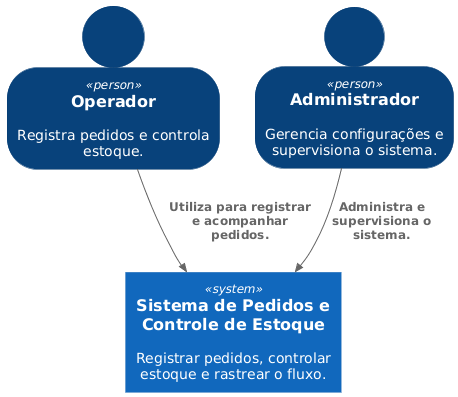
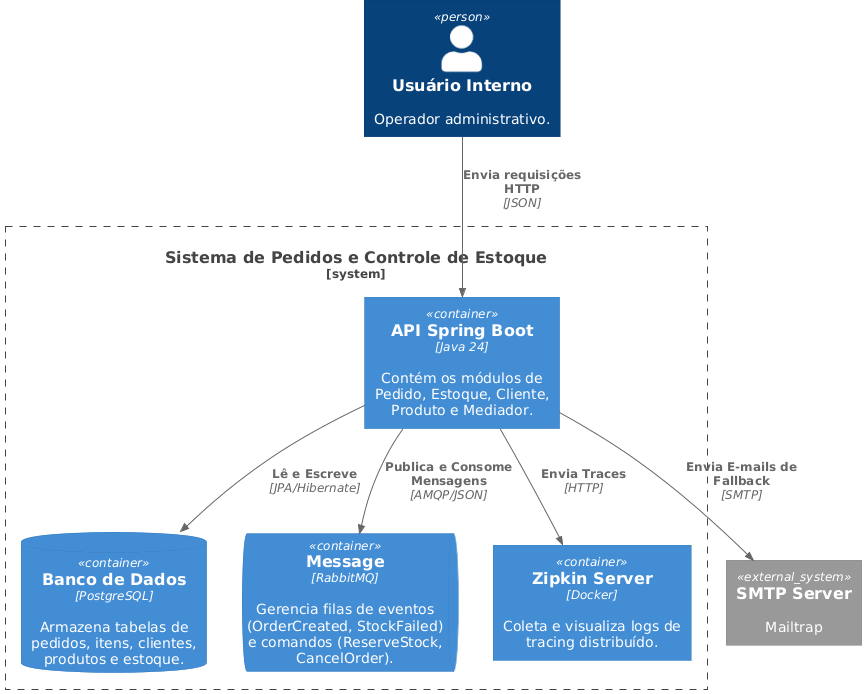
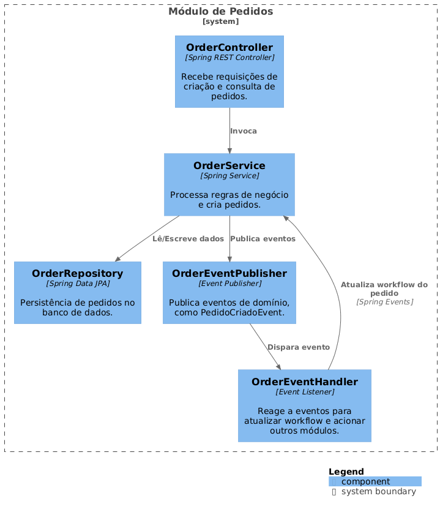
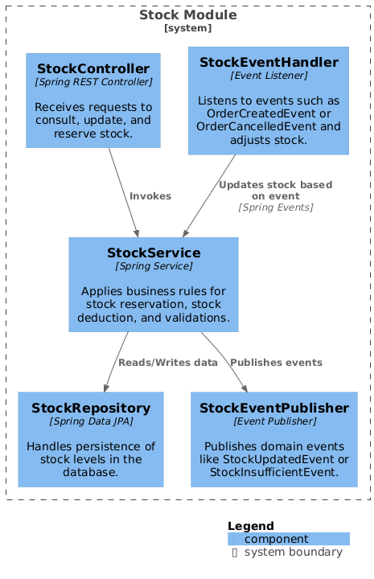
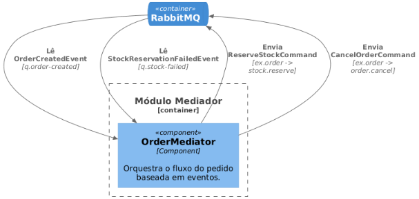

# event-mediator-stock-order-system

Sistema simples baseado em **eventos + mediador**, composto pelos módulos:

- **Pedidos (Order)**
- **Estoque (Stock)**
- **Rastreamento (Tracking)**
- **Event Mediator** (publicação e manipulação de eventos internos)

---

# Arquitetura

A documentação segue o modelo **C4**:

- **C1 – Contexto**
- **C2 – Containers**
- **C3 – Componentes**
- **ADRs – Architectural Decision Records**

---

# ADR 001 — Arquitetura Baseada em Eventos

Local:  
`docs/architecture/adr/ADR-001-architecture-style.md`

---

# C1 – Contexto



Representa o sistema e seus atores externos.

**Atores principais:**

- **Usuário CRUD** – manipula pedidos.
- **Administrador** – gerencia o sistema.
- **Sistema Acadêmico Simplificado** – pode consultar dados do pedido (mock).

---

# C2 – Containers



Contêineres do sistema:

- **API** (Spring Boot / .NET)
- **Order Module**
- **Stock Module**
- **Tracking Module** (simplificado)
- **Event Mediator**
- **Database**

---

# C3 – Componentes

### Pedidos (Order)



### Estoque (Stock)



### Event Mediator



---

# Execução e Desenvolvimento

### 1. Clone o repositório

```sh
git clone https://github.com/usuario/event-mediator-stock-order-system.git

cd event-mediator-stock-order-system
```
